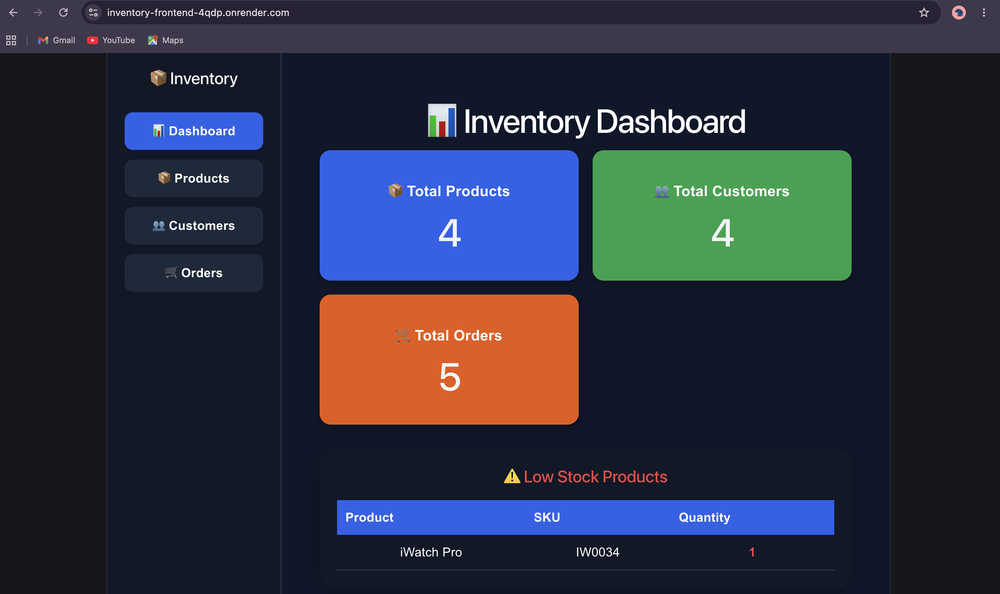
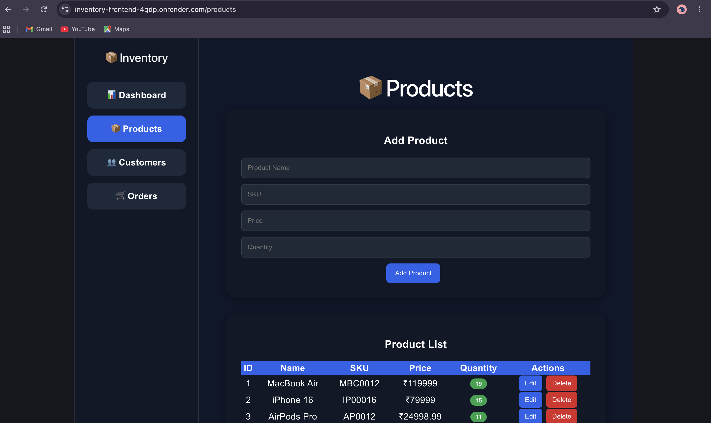
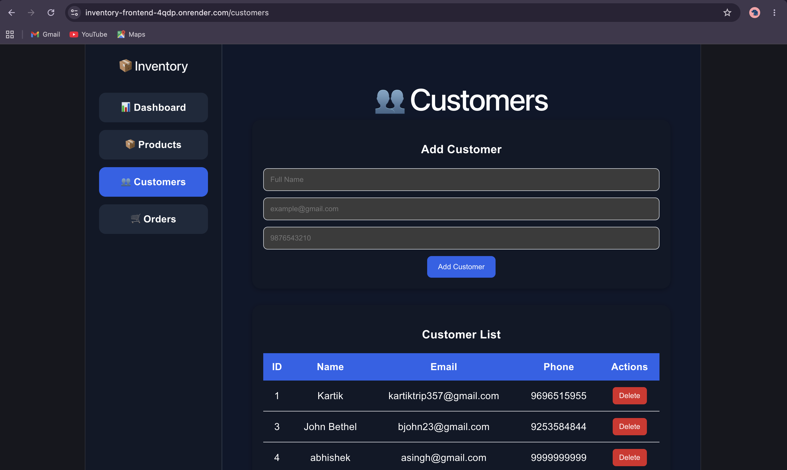
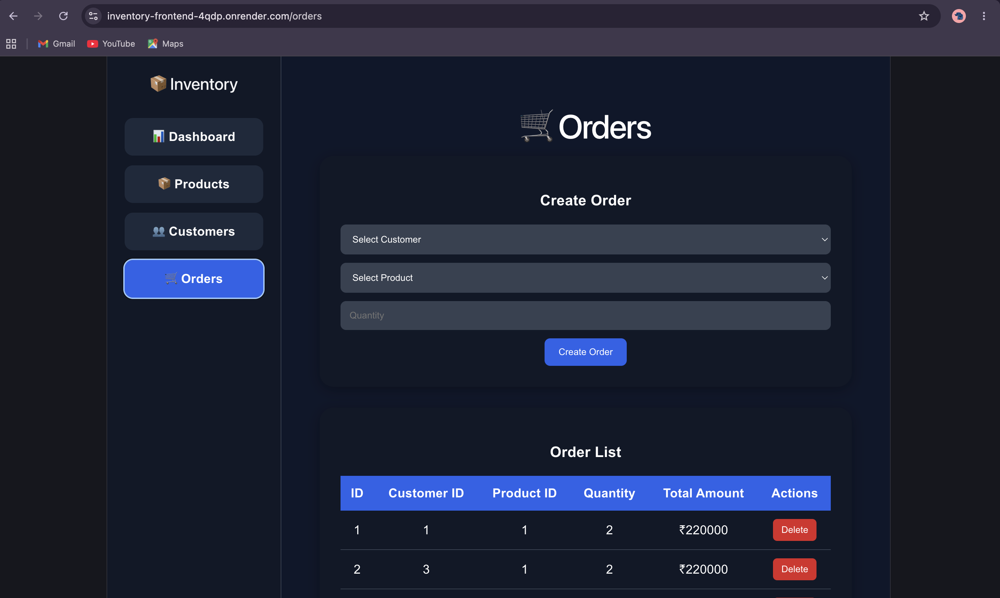

# Inventory Management System

A full-stack Inventory Management System built using **FastAPI, React, PostgreSQL, and Docker**.

The application allows users to manage products, customers, and orders through a clean dashboard interface while maintaining inventory records and tracking order activity.

---

##  Live Demo

# Frontend

https://inventory-frontend-4qdp.onrender.com

# Backend API

https://inventory-backend-ia62.onrender.com/

# API Documentation

https://inventory-backend-ia62.onrender.com/docs

##   Features

###  Dashboard

* View total products
* View total customers
* View total orders
* Monitor low-stock products

###  Product Management

* Add products
* Update product details
* Delete products
* Track stock quantity
* Manage pricing and SKU information

###  Customer Management

* Add customers
* View customer records
* Delete customers
* Store customer contact information

###  Order Management

* Create orders
* Associate customers with products
* Automatic order total calculation
* Delete orders
* Inventory updates after order creation

---

##  Architecture

React Frontend
       │
       ▼
FastAPI Backend
       │
       ▼
PostgreSQL Database

The frontend communicates with the backend using REST APIs. FastAPI handles business logic and database operations while PostgreSQL stores all inventory-related data.

##  Tech Stack

### Frontend

* React
* React Router
* Axios
* Vite

### Backend

* FastAPI
* SQLAlchemy
* Pydantic

### Database

* PostgreSQL

### DevOps & Deployment

* Docker
* Docker Compose
* Render

---

##  Project Structure

inventory-management-system/
│
├── backend/
│   ├── app/
│   ├── requirements.txt
│   └── Dockerfile
│
├── frontend/
│   ├── src/
│   ├── package.json
│   └── Dockerfile
│
├── screenshots/
│   ├── dashboard.png
│   ├── products.png
│   ├── customers.png
│   └── orders.png
│
├── docker-compose.yml
├── .gitignore
└── README.md

##  Application Screenshots

## Dashboard

## Products Management

## Customers Management

## Orders Management

##  Installation

# Clone Repository

git clone https://github.com/KartikT9/inventory-management-system.git

cd inventory-management-system

##  Run With Docker

Build and start all services:

docker-compose up --build

Frontend:

http://localhost:5173

Backend:

http://localhost:8000

## Run Locally

# Backend

cd backend

python -m venv venv

source venv/bin/activate

pip install -r requirements.txt

uvicorn app.main:app --reload

Backend API:

http://localhost:8000

# Frontend

cd frontend

npm install

npm run dev

Frontend:

http://localhost:5173

##  API Endpoints

# Products

| Method | Endpoint       |
| ------ | -------------- |
| GET    | /products      |
| POST   | /products      |
| PUT    | /products/{id} |
| DELETE | /products/{id} |

# Customers

| Method | Endpoint        |
| ------ | --------------- |
| GET    | /customers      |
| POST   | /customers      |
| DELETE | /customers/{id} |

# Orders

| Method | Endpoint     |
| ------ | ------------ |
| GET    | /orders      |
| POST   | /orders      |
| DELETE | /orders/{id} |

---

##  Deployment

# Frontend

Deployed on Render using Docker.

# Backend

Deployed on Render using Docker.

# Database

PostgreSQL

## Future Improvements

* User authentication and authorization
* Role-based access control
* Product search and filtering
* Inventory reports
* Export data to CSV/PDF
* Order analytics dashboard
* Pagination for large datasets
* Email notifications

##  Author

**Kartik Tripathi**

GitHub: https://github.com/KartikT9

LinkedIn: https://in.linkedin.com/in/kartik-tripathi-0bb555238

---
